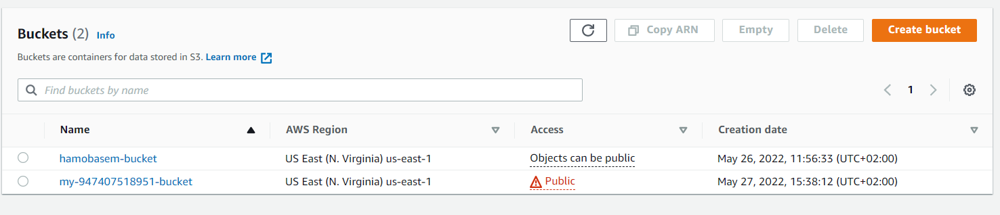

# Deploy Static Website on AWS

## Description

In this project, I will deploy a static website to AWS using S3, CloudFront, and IAM.

The files included are: 
- index.html - The Index document for the website.
- /img - The background image file for the website.
- /vendor - Bootssrap CSS framework, Font, and JavaScript libraries needed for the website to function.
- /css - CSS files for the website.

## Instructions

1. Create S3 bucket
  - bucket name: `my-947407518951-bucket`
  - uncheck: block all public access

2. Upload files and folders: index.html, img, vendor, css

3. Add Policy 
  ```json
  {
    "Version": "2012-10-17",
    "Statement": [
        {
            "Sid": "AddPerm",
            "Effect": "Allow",
            "Principal": "*",
            "Action": "s3:GetObject",
            "Resource": "arn:aws:s3:::my-947407518951-bucket/*"
        }
    ]
  }
  ```

4. Configure S3 as Host Static Website 
  - entry page: index.html
  - error page: index.html

5. Create Distribution vith CloudFront
  - select delivery method: web
  - set `Origin Domain Name` your S3 bucket
  - set `Origin Path` empty (equivalent to “/”)

## Website URL

[https://d19hjar9wc6oht.cloudfront.net](https://d19hjar9wc6oht.cloudfront.net)

## Captures

- The S3 bucket is visible in the AWS Management console.
  

- All website files should be added to the S3 bucket.
  

- The S3 bucket is configured to support static website hosting.
  

- The permission access to the bucket should be configured to allow public access.
  
  

- CloudFront has been configured to retrieve and distribute website files.
  

- Website publicly accessible
  
